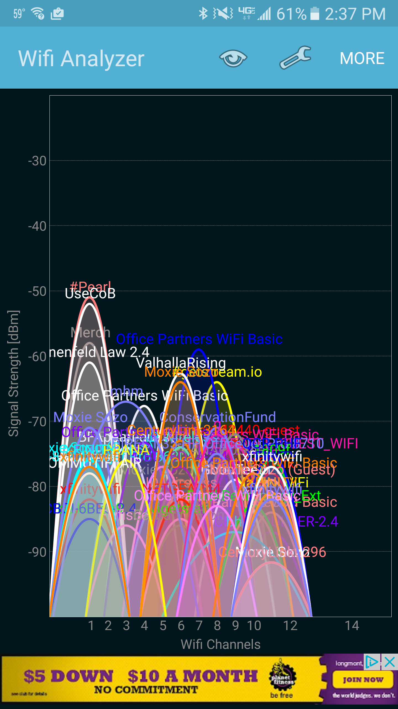
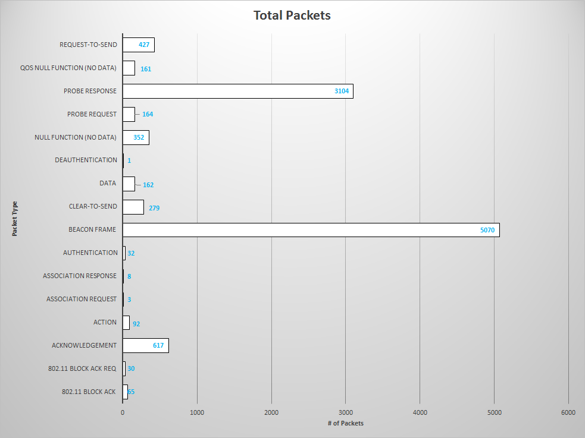
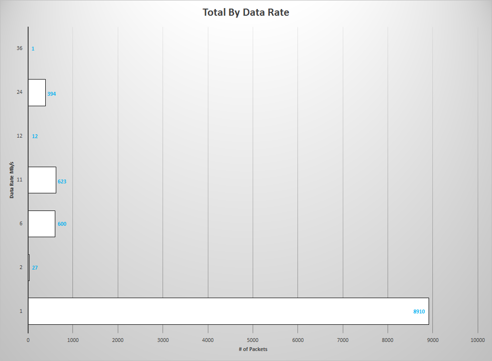

# WLANS_HOMEWORK_3
  
By: __Kevin Stoner__ on _15/03/2017_
  
[Markdown Generated by HWBOT](https://github.com/stonek4/hwbot)
  
___
  
First I set up my laptop and then scanned for access points in the area.  I recorded my data at Pearl Street, and it was very busy.  The following is my setup and a picture from a wifi scanner on my phone. Listing wlans on my computer showed over 80 (on all frequencies).

  
wlp3s0    IEEE 802.11  ESSID:off/any  
          Mode:Managed  Access Point: Not-Associated   Tx-Power=15 dBm   
          Retry short limit:7   RTS thr:off   Fragment thr:off
          Encryption key:off
          Power Management:off

  

  
I decided to scan on channel 1 since it seemed the most busy.  I recorded just over 10,000 packets, and then created the charts as requested below.

  

  

  
Data was captured on March 12, 2017 beginning at 3:50 PM.  It was very busy when I went because it was both a weekend and there was the St. Patrick's Day parade.  Obviously there was a ton of congestion on this channel.  The vast majority of packets were beacons which clogged up the channel with slow 1Mb/s messages and didn't allow anything else to send. I also found it interesting that for every probe request there were tons of probe responses since there were so many access points close together but not working together.  

  
